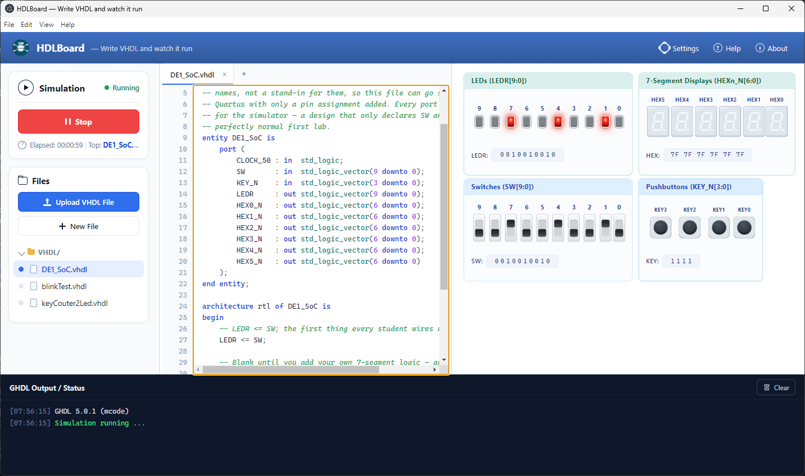

# HDLBoard — Write VHDL and watch it run

Write VHDL and watch it run on a virtual board — flip switches, light LEDs, see it work. Built on GHDL, it's designed to give beginning students a simple first step into FPGA design before tackling timing analysis and beyond. Runs standalone on Windows or hosted in a browser.



## Features

- **Real simulation** — your VHDL runs on [GHDL](https://github.com/ghdl/ghdl), not an approximation; GHDL's own output and errors (file:line included) appear in the console.
- **A live DE1-SoC board** — clickable switches and pushbuttons, with LEDs and 7-segment displays driven by the simulation.
- **A small IDE** — file explorer with upload and drag-and-drop, tabbed editor with VHDL syntax highlighting, resizable panes.
- **Testbenches too** — `report` and `assert` output prints live from a plain, portless testbench.
- **Real-time pacing** — simulated time tracks real time, so a design's timing here predicts its timing on the board.

## Installing

**Windows** — download the installer from the
[**Releases page**](https://github.com/rlangoy/HDLBoard/releases) and run it.
It bundles everything (no Node, GHDL or WSL needed) and installs for the
current user without administrator rights. The installer is not code-signed,
so Windows SmartScreen will warn: choose **More info → Run anyway**.

**In a browser** — needs [Node.js](https://nodejs.org/) 18+. Clone the
repository, then:

```bash
./scripts/start.sh          # ➜ http://localhost:5173/
```

The script installs what's missing: `npm install` for the frontend and the
backend, and [GHDL](https://ghdl.github.io/ghdl/) through your package manager
(it shows the command and asks first). Later runs skip straight to starting.

## Compiling

Building from source, running the dev server, and producing the Windows
installer are covered in [**BUILDING.md**](docs/BUILDING.md).

## Documentation

- [`BUILDING.md`](docs/BUILDING.md) — compile, run and package
- [`Design_Description.md`](docs/Design_Description.md) — how the board components are built, plus features and known limitations
- [`ghdl_implementation_plan.md`](docs/ghdl_implementation_plan.md) — how the GHDL backend works
- [`winInstaller/README.md`](winInstaller/README.md) — the Windows desktop build

## About

Built for **PB1180 Programmerbare logiske kretser** at USN — a browser
simulator for the DE1-SoC board, backed by real GHDL, so students can see
`LEDR <= SW;` and similar constructs actually behave the way the real
board would, without needing hardware in hand.

## License

Licensed under the [GNU General Public License v2.0](LICENSE).
