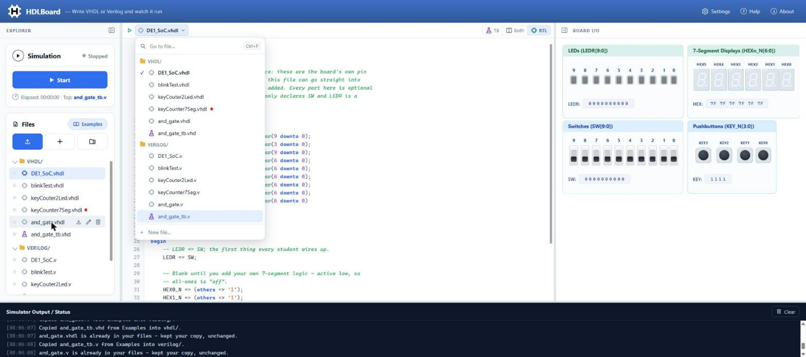
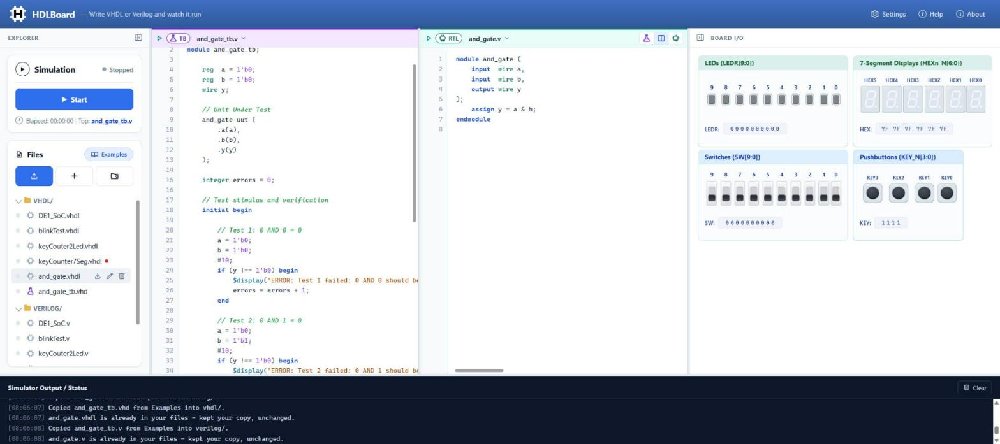

# File Tabs Cleanup — Implementation Specification

> Licensed under the [GNU General Public License v2.0](../LICENSE).

| | |
|---|---|
| **Document** | `docs/cleanup_file_tabs.md` |
| **Version** | 1.3 |
| **Status** | Implemented on branch `cleanup_filetabs` (version 1.3.1); merge to `main` after the student try-out (§ 7.3) |
| **Changes in 1.3** | As built (§ 12): the split keeps its 200 px minimum pane width (D9 changed: 260 px made the split unavailable at a common 1440 px window); narrow headers drop their words instead; an empty pane gets a header too. |
| **Changes in 1.2** | Simplified for novices and for Clean Code (§ 12): the file picker is a plain menu (no search box, no `Ctrl+P`, no recent-file history); deleting a shown file shows its neighbour in the list; one narrow-pane rule; no flag props; fewer modules; a shorter test plan. |
| **Changes elsewhere** | `docs/impl_split_screen.md`: replaces D8 (one tab strip), D14 b (closing the partner's tab), § 4.1 and § 4.5 (the tab strip), the tab-closing rows of § 4.3, and raises the split's minimum pane width (§ 6.5). |
| **Audience** | Beginners: PB1180 students writing their first VHDL or Verilog. Not an expert IDE. |

**How to read it.** § 1.1, the behaviour in § 5 and § 9 are binding. Sizes and
colours in § 5 are design targets: tune them freely while § 9 still holds. § 6 is
guidance on the code: names may change, the Clean Code rules of § 6.1 may not.

---

## Contents

1. [Summary](#1-summary)
2. [What HDLBoard has today](#2-what-hdlboard-has-today)
3. [Inputs and research](#3-inputs-and-research)
4. [Decisions](#4-decisions)
5. [User experience](#5-user-experience)
6. [Code](#6-code)
7. [Testing](#7-testing)
8. [Implementation steps](#8-implementation-steps)
9. [Acceptance criteria](#9-acceptance-criteria)
10. [Out of scope](#10-out-of-scope)
11. [Open questions](#11-open-questions)
12. [Revision notes](#12-revision-notes)
13. [Sources](#13-sources)

---

## 1. Summary

**The editor's tab strip goes away. The Files panel is the file list, and the
editor shows the file picked there.** A slim header above the code names that
file; clicking the name drops down the project's files, for when the Explorer is
hidden.

HDLBoard **has no closed files**: every file is always loaded (in memory in the
browser, saved 600 ms after each edit in the desktop app). Tabs model *open* versus
*closed* and *saved* versus *unsaved*, which HDLBoard does not have, so the strip
is only a second, growing copy of the Files panel. Removing it means:

- a file's name shows in the Files panel and in the header of the pane showing it, nowhere else;
- no horizontal scrollbar, no hidden tabs, nothing to tidy;
- 36 px more code height in the split view (one header row instead of two);
- no "close" button a beginner can mistake for "delete".



*A prototype made in the running app by changing the page by hand (not the final
code). Since 1.2 the menu has no search row, the name is set apart from Play
(§ 5.2), and warnings are rings rather than dots.*

### 1.1 Rules

| # | Rule |
|---|---|
| **F1** | **The Files panel is the only file list that stays on screen.** No tab strip, no Open Files list, no recent-files list. The header's file menu opens on demand and closes after use. |
| **F2** | **The editor always shows a file** while the project has one. Only an empty project shows an empty state. |
| **F3** | **Every pane has one header row, and the file name is its main element.** It sits where the tab strip was and lines up with the Explorer and Board I/O title strips. |
| **F4** | **Lists never reorder themselves.** Files and the file menu list files in the same order: folder, then project order. |
| **F5** | **Nothing a student made is lost or hidden.** Delete in the Files panel, with its confirm, is the only way a file leaves the list. |
| **F6** | **Showing a file never changes which file Start runs** (the top file: the blue dot). Only a click on the dot, Start or Play, or opening an example does, as today. |

---

## 2. What HDLBoard has today

| Area | Today | Consequence |
|---|---|---|
| Tab strip | `EditorTabStrip.tsx`: one tab per open file with Play/Stop, role icon, name, error dot and `×`; a `+` for New File; the view switch at its right end. | Each job needs a new home (§ 5). |
| Tabs pile up | Opening a file, a new file, a console link, an example and a split partner all add tabs; only `×` removes one. | The 12 examples give 12 tabs, a scrollbar under the strip, and the first tab clipped to "7Seg.vhdl" (measured at 1568 px). |
| Split view | Tab strip (39 px) plus pane headers (36 px). | Two rows where one will do. |
| Files panel | Folders `vhdl/`, `verilog/`, `work/`; the top dot; a plain file icon; hover actions that are invisible at rest but keep 76 px, so names are cut ("keyCouter2Led...."). | Names must be readable once Files is the main list. |
| Names | Unique across the whole project, ignoring case (`fileNameRules.ts`). | A name identifies a file. |
| Play | `SimToggle`'s tooltip already says *Start simulation with {file} as top*. | F6 needs no new text. |
| Menus | The role badge uses `.wb-menu` (`role="menu"`, `menuitemradio`) with `usePopover`. | The file menu reuses both. |

---

## 3. Inputs and research

**The brainstorm.** Adopted: a compact switcher showing only the current file, with
a list on demand (§ 5.4); no top tab bar; a clean vertical list with full names,
file-kind icons and status (the Files panel, § 5.5). Not adopted: workspace dropdowns
or switchers (HDLBoard has one project and no workspaces); dirty marks, pins and
close buttons (nothing is ever unsaved, evicted or closed); breadcrumbs (with only a
folder and a file, they repeat the header); a separate Open Files drawer, Recent or
Pinned lists (a second copy of Files, built for dozens of files, where a student has
a handful).

**The reference image** (`docs/images/UI_Example_Moderne filutforsker for HDLBoard.png`).
Adopted: one file header with run controls, a file list that drops down from it, icons
that tell file kinds apart. Not adopted: a permanent Open Files panel beside the tree
(a second list, in the Board I/O column), `●` and `×` on every row, a colour per file.

**Other tools.** VS Code can hide tabs (`workbench.editor.showTabs`) and offers Quick
Open; JetBrains IDEs cap tabs at 10 and evict old ones; EDA Playground puts the
testbench left and the design right, with `+` tabs per pane; Arduino IDE 2, a
beginner IDE, keeps every sketch file open, so its tabs only list the project. NN/g
sums it up: "The fewer tabs, the better", and an overflowing strip hides tabs. The
experts' answers (shortcuts, caps, pins) manage clutter; a beginner tool can remove it.

---

## 4. Decisions

| # | Decision | Why |
|---|---|---|
| D1 | **Remove the tab strip; no setting to bring it back.** The branch is the fallback until the student try-out passes. | A setting keeps two ways to navigate, twice the testing (Clean Code: *prevent over-configurability*). |
| D2 | **The Files panel is the list**, with role icons, problem marks and a "shown" highlight. | It already lists every file, in a stable order. |
| D3 | **Every pane has a header, 39 px**, in the row the tab strip used. | One place for the name and Play in every view; the side panes' title strips still line up. |
| D4 | **The name comes first and is a button with a visible chevron**; Play is set apart from it. | The header answers "which file is this?" before "what can I do?". A visible chevron tells a beginner it can be clicked. |
| D5 | **The file menu is a plain dropdown menu**: every file, grouped by folder as in Files, the shown file ticked, *New file…* at the bottom. No search box, no shortcut. | A student project has 2–20 files: a short list beats a search box. The app already has this menu pattern. |
| D6 | **Colour only where it means something.** Design files: a quiet grey chip. Testbenches: the violet flask. Errors and warnings: a red dot and an amber ring. | Ten teal chips are noise (tried in the prototype); with grey designs the testbench stands out. |
| D7 | **Deleting the shown file shows the next file in the list** (the one before it if it was last). | It is what lists do everywhere, and it needs no history. |
| D8 | **While a simulation runs, other panes show Play greyed out**, with *Stop the simulation first*. | Nothing in the header jumps when a run starts, and the reason is given. |
| D9 | **The split keeps its 200 px minimum pane width; a header narrower than 280 px drops its words** (badge, region navigator, view switch: icons only, tighter spacing), so only the name gives way. | One CSS rule, no special layouts. Raising the minimum to 260 px, the plan in 1.2, made the split unavailable at a common 1440 px window with both side panes open (tried in the build). |
| D10 | **The workspace stores `activeFileId`**; the old `activeTabId` is read when it is missing; `openTabs` is no longer written. | A clear name. An older app version opening a newer workspace keeps every file and shows none: nothing is lost. |

---

## 5. User experience

### 5.1 Layout

```text
Today (12 examples open):
| EXPLORER | 7Seg.vhdl x | keyCounter7Seg.v x | and_gate.vhdl x | ...  [TB|Both|RTL] | BOARD I/O |
|          | <========================= scrollbar ===========================>  |           |
|          | [>][TB] and_gate_tb.v           | [>][RTL] and_gate.v               |           |

After, split view (one row):
| EXPLORER | [>][TB] and_gate_tb.v v         | [>][RTL] and_gate.v v   [F][|][C] | BOARD I/O |

After, one design file (the usual case):
| EXPLORER | [>] |  (c) DE1_SoC.vhdl v                [TB | Both | RTL]    | BOARD I/O |
```



### 5.2 Header, one design file

| Part | Target |
|---|---|
| Row | 39 px including its bottom border; white like the code below; no tint. |
| Play | The existing Play button at the left, then a thin divider (1 × 16 px, 8 px space each side) to set it apart. |
| Name | The main element: quiet role icon, the name (13 px, semibold, main text colour), the problem mark, a grey chevron. Light grey on hover, light blue while its menu is open, a visible focus ring. |
| Right end | The suggestion chip when shown, and the view switch with its labels. |

### 5.3 Headers in the split

The split's pane headers keep their role tint, accent line, Play and role badge
(impl_split_screen.md § 4.4). Changes:

- 39 px tall, so they take the tab strip's row.
- The name becomes the same name button (no role icon: the badge beside it shows the
  role and already separates the name from Play).
- The rightmost pane's header ends with the view switch, icons only (the TB and RTL
  badges right beside it label the icons; the labels stay as tooltips and
  screen-reader text).
- Panes narrower than 280 px show the role badge, the region navigator and the view
  switch without their text, with tighter spacing (D9). Only the name ellipsizes;
  its full text is in its tooltip and in the menu. Measured in the build: at 255 px
  per pane (50/50 in a 1440 px window) "and_gate_tb.v" fits in full; at the 200 px
  minimum a name keeps about 45 px.
- A pane with nothing to show (impl_split_screen.md § 4.6) gets a header too: its
  role, and the view switch when it is the rightmost, so the switch is always there.

### 5.4 The file menu

```text
  [>] | (c) DE1_SoC.vhdl v
       +------------------------------+
       | VHDL/                        |
       |  ✓ (c) DE1_SoC.vhdl          |   ✓ = shown
       |    (c) blinkTest.vhdl        |
       |    (c) keyCounter7Seg.vhdl * |   * = error dot
       |    [F] and_gate_tb.vhd       |   flask = testbench
       | VERILOG/                     |
       |    (c) DE1_SoC.v           o |   o = warning ring
       +------------------------------+
       |  +  New file...              |
       +------------------------------+
```

- **Look**: under the name, 280 px wide (never past the editor's edge), white, rounded,
  with a soft shadow; folder labels and rows look exactly like the Files panel's; it
  scrolls when longer than 60 % of the window.
- **Mouse**: click the name to open; click a file to show it; click outside to close.
- **Keyboard**: `Enter`, `Space` or `↓` on the name opens it with the shown file
  focused; `↑` `↓` `Home` `End` move; `Enter` picks; `Esc` closes and returns to the
  name; `Tab` closes.
- **Picking** shows the file exactly as a click in Files does, then puts the caret in
  its code. *New file…* opens the New File dialog.

### 5.5 The Files panel

| Change | Target |
|---|---|
| Role icon | A quiet grey chip for a design, the violet flask for a testbench, the plain file icon for a file with no code yet. |
| Problem mark | After the name: a red dot for errors, an amber ring for warnings only. The tooltip says *2 errors, 1 warning*. It lives as long as the editor's own markers: until the student clicks in or edits that file, or the next run. |
| Shown | The file in each visible pane gets the light blue highlight. The top file keeps its blue dot, so "shown" and "runs on Start" stay visibly different (F6). |
| Full names | At rest the name has the whole row. On hover, Download / Rename / Delete appear at the row's end on the row's own background, and the name ellipsizes before them, never under them. The tooltip is the full name. |

Everything else in the Files panel stays as it is.

### 5.6 Empty project

Only when there are no files: *No files yet — start from an example, or make your
own.* with **Examples**, **New file** and **Upload** buttons, the same actions as in
Files. Dropping a file on the editor still works.

### 5.7 What happens when

| Event | Shown afterwards |
|---|---|
| Click in Files, or pick in the file menu | That file (and its testbench partner, by the split rules) |
| New file, upload, example, console link, Start / Play | As today, minus the tabs |
| Delete the shown file | The next file in Files order (the one before, if it was last) |
| Delete a file shown in the other pane | The focused file, re-paired by the split rules |
| Delete any other file | Nothing changes |
| Delete the last file | The empty project |
| Rename | The new name in the header and the menu |

The top file changes only as F6 says.

### 5.8 Accessibility

- The name button: `aria-haspopup="menu"`, `aria-expanded`, name *"DE1_SoC.vhdl, switch
  file"*, tooltip *Switch file*.
- The menu: `role="menu"`, a `role="group"` per folder labelled by its name, files as
  `menuitemradio` with `aria-checked` on shown files; *New file…* as `menuitem`.
- Greyed-out Play: `aria-disabled` (still focusable, so its reason is read).
- Contrast: the quiet chip `#7c8aa0` is at least 3:1 on every row background (3.50,
  3.11, 3.02); marks and text keep at least 3:1 and 4.5:1.
- Never colour alone: ✓ and weight for shown, the flask's shape, dot versus ring.

### 5.9 Tokens and text

```css
--wb-role-quiet-ink: #7c8aa0;   /* design chip in lists, >= 3:1 on every row background */
--wb-file-menu-w: 280px;
```

One new icon: `ChevronDownIcon`. Strings: *Switch file*, *New file…*, *Stop the
simulation first*, *No files yet*, *Start from an example, or make your own.*,
*{n} error(s)*, *{n} warning(s)*.

---

## 6. Code

### 6.1 Clean Code, applied

The rules are from the Clean Code summary (wojteklu) the repo already follows.

| Rule | Here |
|---|---|
| *Keep it simple; needless complexity* | No search, no shortcut, no history, one narrow-pane constant. Shown files are derived from the split's state, not stored again. |
| *Prefer polymorphism to if/else; no flag arguments* | Two header components, `PlainPaneHeader` and `RolePaneHeader`, built from shared parts (`PaneRun`, `FileNameButton`), not one header with a `variant` flag. The view switch hides its labels through CSS in the split, not through a `compact` flag. |
| *Functions: small, do one thing, few arguments* | One pure function builds the rows both lists draw; the components only draw. `FileMenu` takes three props: `rows`, `onPick`, `onNewFile`. |
| *No needless repetition; be consistent* | One `FileRowLabel` (icon, name, mark) for Files and the menu. The menu reuses `.wb-menu` and `usePopover`, like the role badge menu. |
| *Encapsulate boundary conditions* | "Which file after a delete" lives in one function, `fileAfterDelete`. |
| *Law of Demeter* | `FileExplorer` gets ready-made rows, not the analysis or diagnostics stores. |
| *Descriptive names* | `activeTabId` → `activeFileId`, `DEFAULT_OPEN_TABS` → `DEFAULT_SHOWN_FILE`, `runIcon.ts` → `paneRun.ts` (`paneRunFor`). |
| *Named constants* | `BLOCKED_REASON`, `EDITOR_EDGE_GAP_PX`, `DEFAULT_SHOWN_FILE`; the 280 px narrow-pane width lives once, in the CSS container query, with a comment. |
| *Boy scout rule* | `EditorTabStrip`, the tab CSS, the tab-only run logic, `withShownTabs` and `onTabClosing` are deleted, not left unused. |
| *Tests: one concept each, fast, independent* | Pure modules are tested without React. |
| *Comments explain intent only* | No comments that repeat the code. |

### 6.2 Modules

| | Files |
|---|---|
| **New** | `fileRows.ts` (pure: `fileRows`, `fileAfterDelete`), `FileRowLabel.tsx`, `FileMenu.tsx` + `.css`, `EmptyProject.tsx` |
| **Renamed** | `runIcon.ts` → `paneRun.ts`: one rule per pane, Play / Stop / greyed-out Play (D8) |
| **Changed** | `EditorPaneHeader.tsx` (the two headers), `SplitEditor.tsx`, `splitPaneModels.tsx`, `useTestbenchSplit.tsx`, `CodeEditor.tsx`, `FileExplorer.tsx` / `.css`, `Workbench.tsx`, `SimToggle.tsx` (a disabled reason), `desktop.ts` (D10), `files.ts`, `index.ts`, `icons.tsx`, `Workbench.css` |
| **Deleted** | `EditorTabStrip.tsx`, the tab-strip CSS |

```ts
/** One file as the Files panel and the file menu draw it. */
export interface FileRow {
  readonly id: string;
  readonly name: string;
  readonly folder: Folder;
  readonly role: FileRole | undefined;
  readonly shown: boolean;
  readonly isTop: boolean;
  readonly errors: number;
  readonly warnings: number;
}

/** Every file in Files order (folder, then project order). */
export function fileRows(files: readonly VhdlFile[], context: RowContext): readonly FileRow[];

/** The file to show after `deletedId` goes: the next in Files order, else the previous, else none. */
export function fileAfterDelete(files: readonly VhdlFile[], deletedId: string): string | null;
```

### 6.3 State

- `openTabs` and its handlers go. `activeFileId` is the file in the focused pane.
- What is shown comes from the split's existing state (pair and view); nothing new is stored.
- Deleting a file still clears it everywhere it is referenced (pair, overrides,
  diagnostics, top file), as today.

### 6.4 Workspace

Write `activeFileId`. Read `activeFileId`, else the old `activeTabId`, else the first
file in Files order. Stop writing `openTabs`. `WORKSPACE_VERSION` stays 1.

### 6.5 Changes to `docs/impl_split_screen.md`

Point these to this spec: D8, D14 b, § 4.1, § 4.3 (tab-closing rows), § 4.5, AC-15,
and B5 (D8 here). Update `tests/e2e/split-screen.md` steps 1, 4 and 7.

---

## 7. Testing

### 7.1 Unit tests

- `fileRows.test.ts`: Files order across the three folders; shown and top are
  independent; quiet warnings are not counted; `fileAfterDelete` for the first, a
  middle and the last file, and the only file.
- `paneRun.test.ts`: the old `runIcon` cases per pane, plus the greyed-out Play.
- `desktop.test.ts`: `activeFileId` written and read; old `activeTabId` read; unknown
  ids fall back to the first file.

### 7.2 Manual checks

In Chrome with the Claude-in-Chrome extension, saved as `tests/e2e/file-switching.md`:

1. Fresh start: one header row; its bottom edge lines up with the side panes' strips.
2. Open all 12 examples: no scrollbar in the editor; every name in Files readable in full.
3. Click `and_gate_tb.v`: the split opens in one row; both shown files highlighted in
   Files; the blue dot has not moved.
4. Hide the Explorer (`Ctrl+B`) and switch files with the header menu, by mouse and by keyboard.
5. A failed run: dot and ring in Files and the menu; they go when the file is clicked.
6. While running, show another design: Play greyed out with its reason; nothing jumps.
7. Delete the shown file, a file in the other pane, and the last file.
8. A long file name; a 1280 px window; browser zoom 200 %: nothing overlaps or clips.

### 7.3 Student try-out

Before merging, ask three people new to HDLBoard to: open a given file; show the
testbench for `and_gate.vhdl`; say which file has an error and open it; say which
file Start runs; delete a file and carry on. Fix anything two of them get stuck on.

---

## 8. Implementation steps

Each step leaves `npm run typecheck` and `npm test` clean and the app working.

| Step | Work |
|---|---|
| **S1** | `fileRows.ts`, `paneRun.ts` (from `runIcon.ts`), their tests. |
| **S2** | Files panel: `FileRowLabel`, shown highlight, problem marks, hover actions. |
| **S3** | Headers: `PlainPaneHeader` / `RolePaneHeader`, 39 px, the view switch at the right end, greyed-out Play, the narrow-header rule. |
| **S4** | Remove the tab strip and `openTabs`; `activeFileId`; `fileAfterDelete`; the empty project; the workspace field. |
| **S5** | The file menu. |
| **S6** | Docs (§ 6.5, README, `Design_Description.md` § 9, `changelog.txt`, a new `workbench.png`), the manual checks, the try-out; then merge. |

---

## 9. Acceptance criteria

1. No tab strip in any view, and no control that closes a file without deleting it.
2. With 12 or more files: no scrollbar in the editor, and every name in Files readable at rest.
3. One 39 px header row in every view, aligned with the side panes' strips; the name is
   its main element, set apart from Play.
4. The file menu lists the same files in the same order as Files, ticks the shown file,
   and works by mouse and keyboard.
5. Showing a file never changes the top file (F6).
6. Files shows role icons, error dots, warning rings and the shown highlight; hover
   actions never cover the name.
7. A one-unit design's Play sends exactly the same `RUN` as in 1.3.0.
8. While a run goes, other panes' Play is greyed out with its reason.
9. § 5.7 holds; deleting the last file shows the empty project with working buttons.
10. A 1.3.0 workspace opens on its file; a newer one opens in 1.3.0 with every file kept.
11. Typecheck and tests clean; no new dependency; plain CSS; § 6.1 followed.

---

## 10. Out of scope

- A search box in the file menu, and a `Ctrl+P` shortcut. Add them if students' projects
  ever grow past what a short menu shows.
- Back/forward between files; drag to reorder; folders made by students.
- A setting that brings tabs back (D1).

---

## 11. Open questions

| # | Question | Until decided |
|---|---|---|
| Q1 | Hide the view switch on a plain design file? Beginners rarely need it there, but it is how *Create testbench* is found. | Keep it; watch the try-out. |
| Q2 | Collapse the folder of the language that is not in use? | No: nothing hides by itself (F5). |

---

## 12. Revision notes

- **1.0** — first version.
- **1.1** — after three reviews: a persistent list versus a temporary picker (F1);
  showing ≠ running (F6); the name first in the header; marks that differ by shape;
  a clean workspace field; a usability check.
- **1.2** — reviewed for over-engineering against "simple for novices" and Clean Code.
  Removed, because a student project has a handful of files: the search box and its
  combobox pattern, the `Ctrl+P` shortcut and its rules, the recent-file history and
  "previous file" highlight, the view switch's narrow menu form and three narrow-pane
  breakpoints (replaced by one minimum pane width), the five deletion cases (now one
  rule: the next file in the list), invariant tables, a separate strings module and
  four of six new modules. Replaced flag props (`variant`, `compact`) with two
  components and CSS. Cut the test plan to what a person can run in one sitting.
- **1.3** — as built on `cleanup_filetabs`. D9 changed: the 260 px minimum pane width
  made the split unavailable at a 1440 px window (a 515 px editor column), so the
  minimum stays 200 px and a narrow header drops its words instead. An empty pane got a
  header, so the view switch is always there. Found and fixed while checking the build:
  a split fraction stored for a wider window was used unclamped (a pane could drop
  below its minimum and the editor scrolled sideways); the file menu's move away from
  the editor's edge was undone by React StrictMode's second effect run; the view
  switch's labels were clipped in a 200 px editor column. Results:
  `tests/e2e/file-switching.md`.

---

## 13. Sources

- [Clean Code summary (wojteklu)](https://gist.github.com/wojteklu/73c6914cc446146b8b533c0988cf8d29)
- [VS Code: User interface](https://code.visualstudio.com/docs/getstarted/userinterface)
- [JetBrains IntelliJ IDEA: Editor basics](https://www.jetbrains.com/help/idea/using-code-editor.html)
- [EDA Playground: FAQ](https://eda-playground.readthedocs.io/en/latest/faq.html)
- [Arduino Forum: Using tabs in IDE 2](https://forum.arduino.cc/t/using-tabs-in-ide2/1152560)
- [NN/g: Tabs, Used Right](https://www.nngroup.com/articles/tabs-used-right/)
- [WAI-ARIA APG: Menu button pattern](https://www.w3.org/WAI/ARIA/apg/patterns/menu-button/)
- [WCAG 2.2: 1.4.11 Non-text Contrast](https://www.w3.org/WAI/WCAG22/Understanding/non-text-contrast.html)
- `docs/images/UI_Example_Moderne filutforsker for HDLBoard.png`, `file_tabs_prototype_switcher.jpg`, `file_tabs_prototype_split.jpg`
