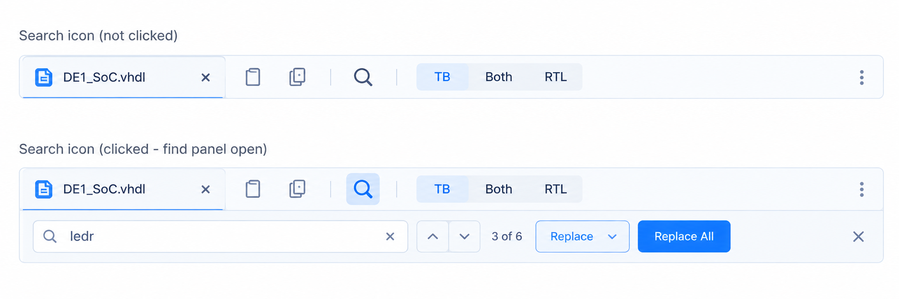

# Text Search (Find / Replace) — Implementation Specification

> Licensed under the [GNU General Public License v2.0](../LICENSE).

| | |
|---|---|
| **Document** | `docs/impl_search.md` |
| **Version** | 1.7 |
| **Status** | Ready for implementation |
| **Changes in 1.1** | The `TB \| Both \| RTL` view switch is removed. The pane's role badge (one labelled TB/RTL icon) takes over view switching from its menu, and Settings decides when the split opens (§ 4.1, D17–D21). This supersedes `docs/impl_split_screen.md` § 4.2 (view switch) and `docs/cleanup_file_tabs.md` § 5.3 where they place the switch. |
| **Changes in 1.2–1.5** | One Find bar searching both files in dual view; review rounds (live text, `applyEdit` exit path, match cap, performance criteria, closed questions). *1.6 replaces the dual-view design. See below.* |
| **Changes in 1.6** | Owner decisions: **each pane has its own Search icon and its own Find bar, and searches only its own file** (S1, D1–D5). The icons sit at the left of each pane header, far apart. **Ctrl+F opens the bar of the pane with the text cursor** (D10). **Replace controls are hidden while there are no matches** (D9a). **Search is always case-insensitive, with no option to change it** (S2). Clarity fixes: Replace continues *after* the inserted text (D8), `applyEdit` gives focus back (D6b), S4 names the fallback exception, Esc and repeat-Ctrl+F behaviour (D10, D12), Unicode-safe matching (D3), corrected test steps, Safari in AC-11. The shared dual-view bar (old D22–D25a, subgrid layout) is dropped. |
| **Changes in 1.7** | Reclassifying a file in the split never leaves two designs or two testbenches side by side: a dialog asks which file to keep (D21a). |
| **Owner** | Rune Langøy |
| **Source** | GitHub issue [#11 *Add Text Search (Find / Replace)*](https://github.com/rlangoy/HDLBoard/issues/11) and its mockup |
| **Branch** | `imp_search_and_replace` |
| **Verified against** | `main` @ `dd01ec7` (package.json 1.4.1, not yet released; latest release is v1.4.0) |
| **Target** | `src/components/workbench/`, React 18.3 + TypeScript 5.6 + Vite 5, plain CSS |

---

## Contents

1. [Summary](#1-summary)
2. [Mockup](#2-mockup)
3. [What HDLBoard already has](#3-what-hdlboard-already-has)
4. [Decisions](#4-decisions)
5. [User experience](#5-user-experience)
6. [Architecture and code](#6-architecture-and-code)
7. [Test plan](#7-test-plan)
8. [Implementation steps](#8-implementation-steps)
9. [Acceptance criteria](#9-acceptance-criteria)
10. [Out of scope (phase 2)](#10-out-of-scope-phase-2)
11. [Open questions](#11-open-questions)

---

## 1. Summary

Every editor pane gets a **Search** button (magnifying glass) in its header,
right after the Copy button. Clicking it, or pressing **Ctrl+F** (**Cmd+F** on
macOS), opens a compact **Find bar** directly under that pane's header. It
searches **that pane's file only**. Matches show in the code as you type: a
soft yellow background on every match and a stronger outline on the current
one. A counter (`3 of 6`) and up/down buttons (or **Enter** / **Shift+Enter**)
step through them. Once there are matches, **Replace** opens a replace field,
with **Replace** and **Replace All**. **Esc** or the **✕** closes the bar.

In dual view (TB | RTL) **each pane has its own Search icon and its own Find
bar**. The two searches are independent, each with its own query, counter and
current match. The icons sit at the left of each pane's header, so each one is
clearly next to the code it searches.

To keep the header uncluttered, the `TB | Both | RTL` view switch is
**removed**. Every pane says what it is with a labelled role badge (flask
**TB** / chip **RTL**), and that badge's menu holds the view choices.
*Settings → Testbench split view* (Automatic / Always / Never) decides when the
split opens by itself (§ 4.1).

### 1.1 Core behaviour rules

These rules are normative. Where a later section seems to disagree with them, the rule wins.

| # | Rule |
|---|---|
| **S1** | **A pane's search covers that pane's file and nothing else.** Each pane that shows a file has its own Search icon, Find bar, query, matches and current match. The other pane, other project files and hidden files are never searched. In dual view the two searches never affect each other. |
| **S2** | Matching is **literal and always case-insensitive**: `ledr`, `LEDR` and `LedR` all match. There is no match-case option, now or later. HDLBoard is for beginners, who may not know that case can matter (Verilog is case-sensitive, VHDL is not). Matches never overlap and never cross a line break. |
| **S3** | Highlighting **never changes glyph metrics**. Only `background`, `box-shadow` and `outline` are used (none of them affects layout), as for the symbol occurrence highlight, so the transparent textarea stays aligned with the `<pre>`. |
| **S4** | Every replacement is a **native text edit** that **Ctrl+Z** can undo, and **Replace All** is **one** undo step. The only exception is the D6 fallback path, used when the browser refuses `insertText`. There, undo is accepted as unavailable. |
| **S5** | A replacement reaches the app through the textarea's normal `onChange`. Diagnostics dismissal, symbol analysis, testbench detection and project saving all work as if the student had typed it. |
| **S6** | Stepping and replacing never move keyboard focus out of the Find field. The pane scrolls to the current match, and focus stays in the Find field until the student leaves it (D6b). |
| **S7** | Search reads the **current editor text**, including edits not yet saved to disk, a GitHub repository or the project file. It is exactly what the pane shows, never a saved copy. |

---

## 2. Mockup

From issue #11 (top: search not clicked, bottom: clicked with the Find bar open):



What the mockup shows, left to right:

- **Header:** file name button · Copy · *(divider)* · **Search** (pressed state: light-blue
  tile, accent-coloured glass) · *(divider)* · `TB | Both | RTL` · ⋮
- **Find bar:** a search field with a leading glass icon and a trailing ✕ that clears it ·
  **∧ / ∨** step buttons in one segmented control · **`3 of 6`** counter ·
  **Replace ⌄** (outlined, expands the replace row) · **Replace All** (filled accent) · **✕** closes the bar
  (far right).

> The mockup has two clipboard-like icons. HDLBoard has **one** Copy button
> (`CopyCodeButton`). Search goes right after it.
>
> **Changed from the mockup:**
> - The `TB | Both | RTL` segment is not built. A labelled role badge sits at the start of the header (§ 4.1).
> - **Replace ⌄** and **Replace All** only show while the query has matches (D9a).
>
> Dual view, each pane with its own icon and bar:
>
> ```text
> [▶][TB ▾][cnt_tb.vhd ▾][⧉]|[🔍]                 │[▶][RTL ▾][cnt.vhd ▾][⧉]|[🔍]
> [🔍 clk         ✕][∧][∨] 2 of 5             [✕] │[🔍 ledr     ✕][∧][∨] 1 of 3 [Replace ⌄][Replace All] [✕]
> ──────────── TB code ───────────────────────────│──────────── RTL code ──────────────────────────────
> ```
>
> Single view with no match (replace controls hidden):
>
> ```text
> [▶][RTL ▾][DE1_SoC.vhd ▾][⧉]|[🔍]
> [🔍 ledx                   ✕][∧][∨] No results                          [✕]
> ```

---

## 3. What HDLBoard already has

| Piece | Where | Why it matters here |
|---|---|---|
| Overlay editor: transparent `<textarea>` over a highlighted `<pre>` | `EditorSurface.tsx` | Typing, selection, caret and undo are native. Highlights are spans in the `<pre>` and must not change metrics (S3). |
| Line decoration splitter | `symbols/decorateLine.ts` (built on `markRanges` in `vhdlHighlight.ts`) | Already cuts tokens at diagnostic and occurrence boundaries. Search ranges are added the same way. |
| Occurrence highlight style | `.wb-editor__occ-ref`, `.wb-editor__occ-decl` in `CodeEditor.css` | The pattern for a metric-safe highlight (background + inset `box-shadow`). |
| Scroll-to-line request | `useRevealLine.ts` (`RevealRequest`, `nextRevealId`) | The model for an id-stamped request that the surface handles once. Find reuses its line-height math. |
| Pane sections | `SplitEditor.tsx` (`SplitPane`): header, optional `model.note`, then `EditorSurface` | The Find bar goes between the header and the code, where `model.note` sits. |
| Pane headers | `EditorPaneHeader.tsx` (`RolePaneHeader`, `PlainPaneHeader`), built in `splitPaneModels.tsx` | The Search button goes after `CopyCodeButton`. The header is a `ReactNode` built outside `SplitEditor`, so the button reaches its pane's find state through a context (§ 6.3). |
| Pane with the text cursor | `focusedPane` in `useTestbenchSplit.tsx`, set by `onFocusPane` when a pane is clicked or focused | Ctrl+F opens this pane's bar (D10). |
| View switch `[TB \| Both \| RTL]` | `ViewSwitch.tsx`, placed by `splitPaneModels.tsx` (`end` of the rightmost header). Calls `ctx.onPin(view)`. `useTestbenchSplit.tsx` `focusViewSwitch()` moves focus to it after a keyboard collapse of the divider. | **Removed** (D17). Its job moves to the role badge menu. |
| Role badge (TB/RTL, a menu) | `RoleBadge` in `EditorPaneHeader.tsx`. Only on `RolePaneHeader`. `PlainPaneHeader` (a design with no testbench) has none. | Becomes the single labelled view control (D18). |
| Split preference | `SplitPreference = 'auto' \| 'always' \| 'never'` (`editorView.ts`), *Settings* dialog (`SettingsDialog.tsx`), hint texts in `testbenchText.ts` | Still decides when the split opens on its own (D20). The *Never* hint mentions the view switch and must change. |
| Header button style | `.wb-copycode` in `SplitEditor.css` (26 × 26, 16 px icon) | Search uses the same size and look (issue: *"same style and size"*). |
| `SearchIcon`, `CloseIcon`, `ChevronDownIcon` | `icons.tsx` | Already exist. Up/down chevrons are new or rotated `ChevronDownIcon`. |
| Global shortcut pattern | `Workbench.tsx:578` (Ctrl+S), `usePaneLayout.ts:377` (Ctrl+B) | Ctrl+F and Ctrl+H follow the same `keydown` listener pattern. |
| Desktop app | Electron 33 (`winInstaller/electron`), menus File / Edit / View / Help | Electron has no built-in find bar, so the in-app one is the only search there. |

---

## 4. Decisions

### 4.1 Replacing the view switch with the role badge

**Should Search replace the `TB | Both | RTL` switch?** Yes, but the switch's
*function* has to go somewhere, because Settings alone does not cover it:

| What the switch does today | Can Settings do it? | Where it goes |
|---|---|---|
| Says which pane is TB and which is RTL | — | Already shown by the role badge in each pane header. The switch repeats it. |
| Opens the split by itself for a testbench | **Yes**: Automatic / Always / Never | Settings (unchanged). |
| Closes the split to one side **for this pair** (a pin, B6) | No. Settings is global. | Badge menu → *Show only this file*. Dragging the divider shut already does this too. |
| Opens the split **for this pair** while the setting is *Never*, or after a close | No | Badge menu → *Show testbench beside* / *Show design beside*. In Automatic mode the suggestion chip still offers it. |
| On a design with no testbench: **Both** opens the empty TB pane with *Create testbench* | No | Badge menu → *Show testbench beside*, which opens the same empty TB pane. |
| Keyboard focus target after the divider is collapsed by keyboard | — | The role badge of the remaining pane. |

So the useful part of the switch is a **per-pair override**. That is rare
enough to go behind one click on the badge, but it can't be removed outright.
Otherwise a student with the setting on *Never* could not see the testbench
beside its design, and a design without a testbench would lose its
*Create testbench* entry point.

| # | Decision | Reason |
|---|---|---|
| **D17** | **Remove `ViewSwitch`.** The rightmost header's `end` slot keeps only the suggestion chip. | Frees the header for Search (issue #11) and removes a control that repeats what the badges already say. |
| **D18** | **Every pane header that shows a file has a role badge**: flask **TB** or chip **RTL**, icon + text, a menu button. `PlainPaneHeader` (a design with no testbench) also gets an **RTL** badge, untinted, to keep today's plain look (cleanup_file_tabs.md § 5.2). | "One labelled icon (RTL/TB) is enough." It is the one place to look for both role and view. |
| **D19** | The badge menu gets a **View** group at the top, above the existing role and pairing items (radio items, the current one checked):<br>• *Show only this file*: pins the view to this pane (`onPin(pane)`)<br>• *Show testbench beside* (on an RTL badge) / *Show design beside* (on a TB badge): pins `both`<br>• *Use the setting (Automatic / Always / Never)*: clears the pin for this pair (checked while there is no pin)<br>When the column is too narrow to split, the *beside* item is disabled with the existing `TEXT.tooNarrow` tooltip. On a **plain design** (no testbench, so no pair to pin), the View group has only *Show testbench beside*, as a plain menu item with no radio state. | Keeps every capability of the switch (table above) in one labelled control. Wording says what happens instead of naming a mode. |
| **D20** | **Settings → Testbench split view** keeps Automatic / Always / Never. The *Never* hint changes from "the view switch still works" to "you can still show a testbench beside its design from the TB/RTL badge". | The setting is the main control for *when* the split opens. The badge only overrides it per pair. |
| **D21a** | **Never two designs or two testbenches side by side.** If *Treat as design* / *Treat as testbench* (or *Use detection*) on one pane would give it the same role as the different file in the other pane, a dialog asks first: *Two designs side by side?* / *Two testbenches side by side?*, with **Keep &lt;this file&gt;** (default), **Keep &lt;other file&gt;** and **Cancel**. Keep applies the role and lays the split out again around the kept file: a design is shown alone (or with its own testbench), and a testbench gets its own design, or an empty RTL pane when it instantiates none. Cancel leaves the role unchanged. A stored pairing that the roles now contradict is ignored (`pairFromOverride`), and a testbench never gets a file marked as a testbench as its design (`pairForTestbench`). With no file in the other pane, or a file shown in both panes, nothing is asked. The plain RTL badge also offers *Use detection* when the file has a role override. | Owner decision: "ask the user what to do". Before this, a role change in the split did nothing visible: the stored pair from *Create testbench* kept the file in its old pane under its old badge. |
| **D21** | Keyboard: after the divider is collapsed by keyboard, `focusViewSwitch()` is renamed `focusRoleBadge()` and focuses the remaining pane's `.wb-rolebadge`. **Alt+Shift+B** (new) toggles the pane with the text cursor between *only this file* and *beside*. **Fallback: Alt+B**, used instead if the § 7.2 step 14 test shows a clash with Windows keyboard-layout switching. Alt+B is free in the desktop app, whose menu mnemonics are File, Edit, View and Help, and in the browsers. Only one of the two ships, and the Help dialog names it. | Replaces the radio group's arrow-key access. Doesn't clash with Ctrl+B (side panel). |

### 4.2 Search decisions

| # | Decision | Reason |
|---|---|---|
| **D1** | **One Search icon per pane header**, right after Copy, with a divider before it. It sits at the **left** part of the header, never at the right end. In dual view the TB pane's icon is therefore inside the TB half, far from the divider, and the RTL pane's icon is just as far into the RTL half. No icon sits next to the other pane's header. An empty pane (empty state) has no icon. | Issue #11 places it after Copy. Two icons spaced well apart make it obvious which file each one searches (S1). |
| **D2** | A pane's Find bar is a row **inside that pane, directly under its header** (between the header and `model.note` / the code). It pushes the code down instead of covering it, and is as wide as its pane. | Issue: *"a compact bar directly under the editor tab/toolbar"*. Covering would hide line 1. A bar inside the pane belongs to that pane alone. |
| **D3** | Matching is literal and case-insensitive (S2). It compares **one character at a time with `toLowerCase`**, never by lowercasing the whole text. A few Unicode characters change length when lowercased (e.g. `İ`), which would shift every match offset after them. `æøå` are safe either way. No regex, whole-word or match-case options. | Beginners, S2. Offsets must always point into the original text. |
| **D4** | Find state lives in **`SplitEditor` as two independent controllers**, `find.tb` and `find.rtl`, each from `useFind(file)` for that pane's file (or `undefined` for an empty pane). They live in `SplitEditor` rather than `SplitPane`, so a pane hidden by `narrowView` or a pin keeps its query and reopens as it was. Each `SplitPane` wraps its header **and** body in `<FindContext.Provider value={find[role]}>`. | Headers are built in `splitPaneModels.tsx`, outside the panes, so the icon needs a context. Two controllers keep S1 trivially true. |
| **D5** | Each `EditorSurface` gets **its own decorations** (`find: FindDecor`) and **one-shot commands** (`findCommand: FindCommand`, id-stamped like `RevealRequest`) from its pane's controller. It runs selection, scroll and edits against its own textarea. | The surface owns the textarea ref. Same pattern as reveal. |
| **D6** | Edits use `setSelectionRange(start, end)` → `document.execCommand('insertText', false, text)` on the pane's textarea. If `execCommand` returns `false`, they fall back to `setRangeText` and call `onChange` directly, without native undo (S4's exception). | `insertText` is the only browser API that keeps the native undo stack on a React-controlled textarea (S4). It is deprecated but still supported in Chromium/Electron, Firefox and Safari. |
| **D6a** | **`execCommand` is known technical debt.** All edits go through one function, `applyEdit(textarea, start, end, text)` in `find/applyEdit.ts`, the only caller of `execCommand`. It returns `'native' \| 'fallback'` (which path ran) and sets `data-last-edit="native\|fallback"` on the textarea, so the § 7.2 undo test can see the path without reading private state. If a browser or Electron release drops reliable `insertText` support, only that function changes: to a custom undo transaction (HDLBoard keeping its own undo stack for the textarea). S4 and S5 must still hold. | Records the debt and keeps the exit path cheap. The current choice should not be read as permanent. |
| **D6b** | **`applyEdit` gives focus back.** `insertText` only edits the focused element, so `applyEdit` notes `document.activeElement`, focuses the textarea with `focus({ preventScroll: true })`, edits, and focuses the noted element again (normally the Find field), all in one task. Because the textarea is in the same pane as the Find bar, the pane's `onFocusPane` does nothing new. | Keeps S6 true for Replace and Replace All. |
| **D7** | **Replace All** selects the whole text (`setSelectionRange(0, length)`) and inserts the fully replaced string in **one** `insertText`. Afterwards the caret goes to the end of the last replacement **without moving the view**: `applyEdit` saves `scrollTop` / `scrollLeft` before the insert and restores them in the same frame, since inserting the whole text would otherwise scroll the textarea to the end. | One undo step (S4). Replacing from the end backwards would mean N undo steps. The student keeps looking at the code they were looking at. |
| **D8** | **Replace** replaces the *current* match only if the textarea text at its range still matches the query (case-insensitively). It then moves to the first match that starts **at or after the end of the inserted text** (`old start + replacement length`), wrapping to the first match. If the current match is stale, Replace only re-finds and replaces nothing. | Continuing after the inserted text means a replacement that contains the query (`ledr` → `LEDR_x`) is never replaced again. |
| **D9** | **Replace All** stays in row 1 next to Replace ⌄. If the replace row is closed, it **opens the row and focuses the Replace field** instead of replacing. | Avoids an accidental "replace with nothing", which deletes every match. |
| **D9a** | **Replace controls are hidden while there are no matches.** When the query is empty or has 0 matches, Replace ⌄, Replace All and the whole replace row (row 2) are not shown. The bar is then just `[Find field] [∧][∨] [counter] [✕]`. They **appear at once** when matches appear, with row 2 open again if it was open before and the replacement text kept. They **hide only after the 0-match state has lasted 400 ms**, so a typo while typing doesn't make the code jump up and down. | Less clutter: there is nothing to replace. The 400 ms delay prevents flicker. |
| **D10** | **Ctrl/Cmd+F** is caught (`preventDefault`) while a file is shown and no modal dialog is open. It opens the Find bar of the **pane with the text cursor** (`focusedPane`: the pane last clicked or typed in, same as for copying). The other pane's bar is not touched. If that pane has a one-line selection (≤ 200 chars), the selection becomes the query (cleaned like pasted text, § 6.2). With no selection, the previous query is kept. The Find field gets focus with its text selected, and the current match is the first at or after the caret. **Pressed while the bar is already open**, it does the same: refocus and select the Find field, take a fresh selection if there is one. Clicking a pane's icon always opens **that** pane's bar, whichever pane has the cursor. | Students expect Ctrl+F to search the code they are working in. In Electron there is no other find bar. |
| **D11** | **Ctrl/Cmd+H** does the same as Ctrl+F, and also opens the replace row if the query has matches (D9a). | VS Code convention. Browser history (Ctrl+H) is not useful inside HDLBoard. See Q2. |
| **D12** | **Esc**, ✕ and **clicking the pressed icon** all close a pane's bar. Esc works when focus is in that bar or in that pane's textarea. Esc in the other pane's textarea closes only the other pane's bar, if it is open. Closing puts focus in **that pane's** textarea and selects the current match (or leaves the caret alone if there is none). The query is kept for the next open. One Esc always closes, even with the replace row open. | Issue: *"Close with X or Esc"*. Keeping the query matches VS Code. A two-step Esc would be a guess about what the student wants. |
| **D13** | When the pane's **file** changes (another file opened in it), its bar stays open and keeps its query. Matches are recalculated, and the current match resets to the first at or after the caret. While a pane is hidden (pin, narrow column), its bar state is kept and shows again with the pane. | The query is often the same name in the next file. |
| **D14** | After an edit **in the code** (typing, paste, undo), matches are recalculated and the current match becomes the first match whose start is ≥ the old current match's start, wrapping to the first. (After **Replace**, D8 applies instead.) | The current match stays close to where the student was. |
| **D14a** | **No match work while the bar is closed.** A pane's controller ignores text changes while its bar is closed. Matches are calculated when the bar opens, from the caret (D10). | Typing in the code costs nothing extra when nobody is searching. Protects AC-13 and AC-14. |
| **D15** | Matches are capped at `MAX_MATCHES` per pane, initially **10 000**, a named constant in `findMatches.ts`. Tune it from profiling against AC-14. Matches past the cap are neither counted, listed nor highlighted. The counter then shows `x of 10000+`, with the number taken from the constant, never a literal. | Protects the render loop on pasted huge files. The real limit should come from measurement, not a guess. |
| **D16** | Search highlight and symbol-occurrence highlight can both apply. Find is the **outer** wrapper, so its background wins, and the occurrence underline (inset `box-shadow`) still shows through. The current match's outline is drawn with `outline` + `outline-offset: -1px`, so it never stacks with the shadow. | Both cues stay visible and metrics are unchanged (S3). |
| **D22** | **Same file in both panes** (a file holding both testbench and design, shown in both). Each pane still has its own independent search over that file (S1). An edit made from one pane, including Replace All, changes the one shared text. The other pane sees it as an edit (D14), and the other pane's bar, if open, recalculates. Replace All in one pane replaces in the **whole file**, including the part the other pane is showing. | One file, one text. Searching it twice independently is simple and predictable. |

---

## 5. User experience

### 5.1 Search button (header)

- Placement: `[Play] [TB/RTL badge ▾] [name ▾] [Copy] | [Search] ……… [suggestion chip]`
  (`PlainPaneHeader`: `[Play] | [RTL badge ▾] [name ▾] [Copy] | [Search] …`). There is no view switch (D17).
  The icon stays in the left group of its own header (D1).
- Same box as `.wb-copycode`: 26 × 26, 16 px icon, transparent background, muted colour, hover tint, focus ring.
- **Pressed** (that pane's bar is open): `aria-pressed="true"`, background `var(--wb-accent-soft)` (the
  light blue of the mockup's pressed tile), icon colour `var(--wb-accent)`. In dual view each icon shows its own pane's state.
- `aria-label="Search in <file name>"`, `title="Find in this file (Ctrl+F)"` (`⌘F` on macOS).
- Clicking toggles that pane's bar. Opening focuses its Find field. Closing follows D12.

### 5.2 Find bar, row 1

| Element | Behaviour |
|---|---|
| **Find field** | Leading glass icon, placeholder `Find`. Typing updates matches on every keystroke, or after an 80 ms debounce once the pane's file is large: `content.length` above `DEBOUNCE_ABOVE_CHARS = 200_000` (UTF-16 code units, `useFind.ts`). Trailing ✕ clears the field and keeps focus in it, and only shows when the field has text. `aria-label="Find in <file name>"`. |
| **∧ / ∨** | Previous / next match, wrapping around. Disabled when there are 0 matches. Tooltips `Previous match (Shift+Enter)` / `Next match (Enter)`. |
| **Counter** | `x of n`; `No results` when the query is non-empty and n = 0 (the field also gets a red border, `aria-invalid="true"`); empty when the query is empty. The visible counter updates with the matches. A separate `aria-live="polite"` region (screen readers only) copies its text **400 ms after the last keystroke**, so a screen reader reads one result per pause instead of one per letter. Stepping and Replace update it at once. |
| **Replace ⌄** | Only while there are matches (D9a). Toggles the replace row (`aria-expanded`). Chevron rotates 180° when open. |
| **Replace All** | Only while there are matches (D9a). Filled accent button. See D9. |
| **✕ (far right)** | Closes the bar (D12). `aria-label="Close find"`. |

Keyboard in the Find field: **Enter** = next, **Shift+Enter** = previous,
**Esc** = close, **Tab** goes through the bar's controls in order.

### 5.3 Find bar, row 2 (replace, when expanded and there are matches)

`[Replace field                              ] [Replace]`

- Placeholder `Replace`. Lines up under the Find field (same width).
- **Replace** button (outlined) does D8. In the Replace field, **Enter** = Replace, **Ctrl/Cmd+Enter** = Replace All (D7).
- If the row hides because the matches run out (D9a) while focus is in it, focus moves to the Find field.
- After Replace All the counter shows `Replaced n` for 1.5 s (same timing as Copy's
  `CONFIRMATION_MS`), then the new count or `No results`. All bar strings (`Replaced n`,
  `No results`, `x of n`, labels, tooltips) live in one table, `FIND_TEXT` in `find/findText.ts`,
  so UI tests can check them exactly.

### 5.4 In the code

- Every match: `.wb-editor__find-match` with background `var(--wb-find-bg)` (soft yellow, `#fff3a3` light / `rgba(255, 213, 0, 0.28)` dark).
- Current match: `.wb-editor__find-current` with a stronger background `var(--wb-find-current-bg)` (`#ffd54a`) **plus**
  `outline: 1px solid var(--wb-find-current-outline)` (`#c99a00`), `outline-offset: -1px`, `border-radius: 2px`.
- Stepping to a match scrolls the pane's textarea so its line is in the middle (as `useRevealLine` does) **and**
  horizontally so the match is visible. If the match is already in view, it does not scroll.
  The horizontal position is read from the rendered current-match span (`.wb-editor__find-current` in the
  `<pre>`, its `offsetLeft` / `offsetWidth`). Column × `ch` arithmetic would drift on tabs (`tab-size: 4`) and on
  glyphs from a fallback font (e.g. `æøå` in comments). If the span is not in the DOM yet (the first
  paint after opening, typing or a replace), the reveal waits one `requestAnimationFrame` and measures again.
  It never scrolls horizontally from a guess. Vertical scrolling doesn't need the span and happens at once.
- The overview of matches on the scrollbar (VS Code style ticks) is phase 2.

### 5.5 Narrow panes

- A bar wraps when it is narrower than **420 px**. This is a container query on `.wb-findbar`
  (`container-type: inline-size`), written once in `FindBar.css` as `@container findbar (max-width: 420px)`,
  with a comment naming it `FINDBAR_WRAP_PX`. `FindBar.tsx` exports `FINDBAR_WRAP_PX = 420` for tests. CSS custom
  properties can't be used in a container query condition, so this pair is the one place the number is kept.
  Below it, row 1 is `[Find field ………] [∧][∨] [x of n] [✕]` and, while there are matches,
  **Replace ⌄ / Replace All** move to the start of row 2.
- In dual view each bar is as wide as its own pane, so a narrow pane wraps on its own.

---

## 6. Architecture and code

### 6.1 New files

```
src/components/workbench/find/
  findMatches.ts        pure: query + text → match ranges; per-line split; replaceAll text
  findMatches.test.ts
  findNavigation.ts     pure: next/previous index, index after a code edit (D14), after Replace (D8), at-or-after caret
  findNavigation.test.ts
  useFind.ts            one pane's find state over its file; returns FindController
  FindContext.ts        React context: the pane's FindController (or null)
  applyEdit.ts          the only execCommand caller: one undoable textarea edit, focus given back (D6–D6b)
  findText.ts           every string the bar shows (§ 5.3)
  FindBar.tsx           the bar (rows 1 and 2)
  FindBar.css
  SearchToggle.tsx      the header button
```

### 6.2 Pure core (`findMatches.ts`)

```ts
/** A match as offsets into the whole text, end exclusive. */
export interface TextMatch { readonly start: number; readonly end: number; }

export const MAX_MATCHES = 10_000;

/** Literal, case-insensitive per character (D3), non-overlapping, never across '\n'. Empty query → []. Pure. */
export function findMatches(text: string, query: string): { matches: TextMatch[]; capped: boolean };

/** Matches grouped by 0-based line as CharRanges relative to the line start (for decorateLine). Pure. */
export function matchesByLine(text: string, matches: readonly TextMatch[]): ReadonlyMap<number, readonly CharRange[]>;

/** The text with every match replaced by `replacement`, and where the last replacement ends. Pure. */
export function replaceAllText(text: string, matches: readonly TextMatch[], replacement: string): { text: string; caret: number };
```

The Find field turns pasted line breaks into spaces, and so does a seed taken from a selection (D10).

### 6.3 State and context

```ts
// useFind.ts — one per pane
export interface FindController {
  readonly open: boolean;
  readonly query: string;
  readonly replacement: string;
  readonly replaceOpen: boolean;
  /** Whether Replace ⌄ / Replace All / row 2 show (D9a: matches, with the 400 ms hide delay). */
  readonly replaceVisible: boolean;
  readonly matches: readonly TextMatch[];
  readonly capped: boolean;
  readonly currentIndex: number;           // -1 when no matches
  readonly decor: FindDecor;               // for this pane's EditorSurface
  readonly command: FindCommand | null;    // for this pane's EditorSurface
  openBar(opts?: { seed?: string; replace?: boolean }): void;
  close(): void;
  setQuery(q: string): void;
  setReplacement(r: string): void;
  toggleReplace(): void;
  step(dir: 1 | -1): void;
  replaceCurrent(): void;
  replaceAll(): void;
  /** The surface reports edits and caret moves (D13, D14). Ignored while the bar is closed (D14a). */
  onSurfaceText(text: string, caret: number): void;
}
```

`SplitEditor` creates `find = { tb: useFind(tbFile), rtl: useFind(rtlFile) }` (D4). Each
`SplitPane` wraps its header and body in `<FindContext.Provider value={find[role]}>`, renders
`<FindBar />` between the header and `model.note`, and passes `decor` / `command` to its
`EditorSurface`. `SearchToggle` reads the context (it renders nothing when the context is `null`,
e.g. under an `EmptyPaneHeader`).

### 6.4 `EditorSurface` changes

New optional props:

```ts
/** Search highlights: ranges by 0-based line, and the current match. */
find?: FindDecor;          // { byLine: ReadonlyMap<number, readonly CharRange[]>; current: TextMatch | null; currentLine: number }
/** One-shot: select/scroll to a match, or apply an edit (D6, D7). Handled once per id. */
findCommand?: FindCommand | null;
// type FindCommand =
//   | { id: number; kind: 'reveal'; match: TextMatch; focus: boolean }
//   | { id: number; kind: 'replace'; match: TextMatch; text: string }
//   | { id: number; kind: 'replaceAll'; text: string; caret: number };
```

- `HighlightedLine` gets `findRanges` and `currentRange` for its line, and these are passed to `decorateLine`.
  It stays `memo`'d. Lines with no matches get a shared empty array, so typing in the Find field
  only re-renders lines whose matches changed.
- A `useFindCommand(textareaRef, file, findCommand)` hook (beside `useRevealLine`) runs the command once per `id`:
  - `reveal`: scroll (vertical with the `useRevealLine` math, horizontal from the current-match span, § 5.4) and
    `setSelectionRange(match.start, match.end)`. It calls `focus()` only when `focus` is true (on close, D12).
  - `replace` / `replaceAll`: through `applyEdit` (D6–D7). The resulting `input` event fires React's `onChange`, so S5 holds with no extra wiring.
- The surface's `onKeyDown` handles **Esc** → its own pane's `find.close()` when that bar is open (D12).

### 6.5 `decorateLine` changes

```ts
export interface DecoratedPiece extends MarkedToken {
  readonly occurrence?: OccurrenceKind;
  readonly find?: 'match' | 'current';
}

export function decorateLine(
  tokens: readonly Token[],
  diagnosticRanges: readonly CharRange[],
  occurrences: readonly Occurrence[],
  findRanges: readonly CharRange[] = [],
  currentFind?: CharRange,
): DecoratedPiece[];
```

Find ranges join the cut list passed to `markRanges`. `TokenPiece` wraps a piece with `find`
in `<span class="wb-editor__find-match">` (plus `is-current`) as the **outermost** wrapper (D16).
The fast path (no occurrences, no find ranges) is unchanged.

### 6.6 Header and shortcuts

- `RolePaneHeader` and `PlainPaneHeader`: insert `<span className="wb-panehead__divider" /> <SearchToggle />`
  right after `<CopyCodeButton …/>`, before the spacer (D1).
- Ctrl/Cmd+F and Ctrl/Cmd+H: one `keydown` listener in `SplitEditor` (on `window`, removed on unmount).
  It checks that no `[role="dialog"][aria-modal="true"]` is open, calls `preventDefault()` and calls
  `find[focusedPane].openBar(...)` with the seed from that pane's textarea selection (D10, D11).

### 6.6a Removing the view switch (D17–D21)

| File | Change |
|---|---|
| `ViewSwitch.tsx` | Delete. Remove its `.wb-viewswitch*` rules from `SplitEditor.css`. |
| `splitPaneModels.tsx` | `end` = `{chip}` only. Pass `view`, `pinned`, `canSplit` and `onPin` into the header models so the badge menu can show and change the view. |
| `EditorPaneHeader.tsx` | `RoleBadge`: add the **View** group (D19) above the role items. `PlainPaneHeader`: render an RTL `RoleBadge` (untinted `is-plain` variant) whose menu has *Show testbench beside* only (D19) and *Treat as testbench*. Pairing stays in the menu as today. |
| `testbenchText.ts` | New strings: `showOnlyThisFile`, `showTestbenchBeside`, `showDesignBeside`, `useSplitSetting`, `viewGroup`. Remove `bothLabel` / `bothTooltip` / `editorView` if nothing else uses them. Change `settingNeverHint` (D20). |
| `useTestbenchSplit.tsx` | `focusViewSwitch()` → `focusRoleBadge()` (D21). Add an Alt+Shift+B handler beside the existing Alt+PageUp/PageDown one. |
| `HelpDialog.tsx` | Replace the view switch description with the badge menu and Alt+Shift+B. |
| `README.md` (workbench) | Update the component list. |
| `docs/impl_split_screen.md`, `docs/cleanup_file_tabs.md` | Add a "Superseded by impl_search.md" note at § 4.2 / § 5.3. |

`resolveView`, `showsSuggestion`, pins and the setting stay exactly as they are. Only the control that calls `onPin` moves.

### 6.7 CSS

- `FindBar.css`: `.wb-findbar` (row layout, `gap: 8px`, `padding: 6px 12px`, bottom border
  `var(--wb-border)`, background `var(--wb-sidebar-bg)`, `container: findbar / inline-size`),
  `.wb-findbar__field`, `.wb-findbar__steps` (segmented), `.wb-findbar__count` (`min-width: 7ch`,
  tabular numbers), `.wb-findbar__btn`, `.wb-findbar__btn--primary`.
- `CodeEditor.css`: `--wb-find-*` tokens (light + dark) and `.wb-editor__find-match` / `.is-current`.
- `SplitEditor.css`: `.wb-searchtoggle` (shares the `.wb-copycode` rules) and `[aria-pressed="true"]`.

---

## 7. Test plan

### 7.1 Unit (Vitest, colocated)

| File | Cases |
|---|---|
| `findMatches.test.ts` | empty query → none; case-insensitive (`LEDR` finds `ledr`, `LedR`); a text containing `İ` before a match keeps correct offsets (D3); non-overlapping (`aa` in `aaaa` → 2); never across `\n`; cap at `MAX_MATCHES` sets `capped`; `matchesByLine` offsets per line incl. empty lines; `replaceAllText` with a longer, shorter and empty replacement, and `caret`. |
| `findNavigation.test.ts` | next/previous wrap; at-or-after caret (D10); index after a code edit before, inside and after the current match (D14); after Replace with a replacement **containing** the query, the next current match is after the inserted text (D8); 0 matches → −1. |
| `useFind` (React Testing Library) | two controllers are independent (S1); `replaceVisible` false for empty query and 0 matches, true at once on a match, false only after 400 ms of 0 matches (D9a); closed bar ignores `onSurfaceText` (D14a). |
| `EditorPaneHeader` (React Testing Library) | Badge menu View group: *Show only this file* → `onPin(pane)`; *beside* → `onPin('both')`, disabled when `!canSplit`; *Use the setting* → pin cleared. A plain design header has an RTL badge. |
| `symbols/decorateLine.test.ts` | find ranges cut tokens; pieces rejoin to the line; find + occurrence overlap labels both; current flag only on the current range; no find ranges → identical output to today. |

### 7.2 UI (Claude-in-Chrome, per project practice)

Run against `npm run dev` with the backend up (set `IVERILOG_DIR` for Verilog):

1. Open `DE1_SoC.vhd`, click Search → icon pressed, bar under the header, focus in Find. No Replace controls yet.
2. Type `ledr` → every match yellow (including `LEDR`), first has outline, counter `1 of n`, Replace ⌄ and Replace All appear.
3. Enter ×2 → `3 of n`, code scrolls. Shift+Enter → `2 of n`.
4. Replace ⌄ → row 2. Replace with `LED_R` → one replaced, counter `2 of n-1`, focus still in the Find field. Ctrl+Z in the code undoes it.
5. Replace with `LEDR_x` (contains the query) → the inserted text is not the next current match, and pressing Replace again moves on instead of producing `LEDR_x_x` (D8).
6. Replace All with `LED_R` → all replaced, `Replaced n`, the view doesn't jump, Replace controls hide once `No results` has shown for 400 ms. One Ctrl+Z restores all.
7. Type `ledx` → `No results`, no Replace controls. Type a typo and fix it quickly → the replace row doesn't flicker.
8. Esc → bar closes, current match selected in the textarea. Ctrl+F reopens with the query kept. Ctrl+F again while open → Find field refocused and selected.
9. **Dual view:** both headers have a Search icon at their left, far apart. Click the TB icon → only the TB pane gets a bar, and it searches only the TB file. Click the RTL icon → the RTL pane gets its own bar. Give them different queries: each keeps its own counter and current match, and Replace All in one pane doesn't change the other file.
10. Dual view: click in the RTL code, Ctrl+F → the RTL bar opens. Click in the TB code, Ctrl+F → the TB bar opens, and the RTL bar stays as it was. Esc in the TB code closes only the TB bar.
11. Select `clk` in the code, Ctrl+F → query is `clk`.
12. Hover a signal while searching → occurrence underline still visible under the yellow.
13. Simulate after Replace All → it builds the edited code (S5).
14. No `TB | Both | RTL` switch anywhere. A TB badge → *Show only this file* collapses to TB. The RTL badge → *Show testbench beside* reopens the split, and the RTL bar is back as it was (D13). Setting = Never, open a testbench → single pane, then badge → *Show design beside* → split. A plain design → RTL badge → *Show testbench beside* → empty TB pane with *Create testbench* and no Search icon. Collapse the divider by keyboard → focus lands on the remaining badge. Alt+Shift+B toggles the split. On Windows, also check Alt+Shift+B with two keyboard layouts installed (Alt+Shift may switch layouts). If it clashes, ship Alt+B (D21).
15. **Same file in both panes:** open a file holding a testbench and its design so both panes show it. Search in the TB pane and Replace All → the whole file changes, the RTL pane shows the new text, and its open bar (if any) recalculates (D22).
16. **Firefox and Safari undo:** repeat steps 4 and 6 in Firefox and Safari. Ctrl+Z (⌘Z) must undo a Replace, and one Ctrl+Z must undo a Replace All. Read `data-last-edit` on the textarea to see which path ran. If either fails, fix it in `applyEdit` only (D6a).

---

## 8. Implementation steps

1. `find/findMatches.ts` + tests.
2. `find/findNavigation.ts` + tests.
3. Extend `decorateLine` + tests. Wire `findRanges`/`currentFind` through `HighlightedLine`/`TokenPiece` (no UI yet).
4. CSS tokens and highlight classes. Hard-code a query temporarily to check alignment in light/dark at 100 % and 125 % zoom.
5. `useFind` + `FindContext` + tests. Two controllers in `SplitEditor`, provided per `SplitPane` (D4).
6. `SearchToggle` in both pane headers, then `FindBar` row 1 (find, steps, counter, close).
7. `applyEdit` (D6–D6b), then `useFindCommand` in `EditorSurface`: `reveal` first, then `replace` / `replaceAll`.
8. Replace ⌄ / Replace All / row 2, with D8, D9 and D9a.
9. Ctrl/Cmd+F, Ctrl/Cmd+H, Esc (D10–D12).
10. Narrow-pane wrap (§ 5.5), dark theme pass, a11y check (labels, live region, focus order).
11. Remove `ViewSwitch` and add the badge View group (§ 6.6a), with its tests.
12. `npm run typecheck`, `npm test`, `npm run build`. Then run the UI script in § 7.2.
13. Add the feature to `docs/changelog.txt` and the Help dialog shortcut list.

---

## 9. Acceptance criteria

| # | Criterion |
|---|---|
| AC-1 | Every pane header showing a file has its own Search icon right after Copy, in the left part of the header, matching Copy's size and style, pressed while that pane's bar is open. In dual view the two icons are clearly apart, one in each half. |
| AC-2 | Clicking a pane's icon opens that pane's Find bar under its header with focus in the Find field. Ctrl+F / Cmd+F opens the bar of the pane with the text cursor. The browser's own find bar does not open. |
| AC-3 | Typing highlights all matches in that pane's file at once (soft yellow), whatever their case, and the current one with a stronger outline. Text stays perfectly aligned with the caret and selection. |
| AC-4 | The counter shows `x of n`, and `No results` for a query with no matches. |
| AC-5 | ∧/∨, Enter and Shift+Enter move between matches (wrapping), and the pane scrolls the current match into view. |
| AC-6 | With matches, Replace ⌄ shows the replace field. Replace changes only the current match and moves on past the inserted text. Replace All changes every match in that pane's file. Focus stays in the bar. |
| AC-7 | Ctrl+Z undoes a Replace. One Ctrl+Z undoes a whole Replace All. |
| AC-8 | Esc, ✕ or clicking the pressed icon closes the bar and returns focus to that pane's code with the current match selected. |
| AC-9 | A pane's search covers only its own file. In dual view the two panes' searches are fully independent. |
| AC-10 | Edited text after a replace is treated exactly like typed text (diagnostics, symbol highlight, testbench detection, save, simulate). |
| AC-11 | Works in Chrome, Edge, Firefox, Safari and the Electron desktop app, in light and dark theme. |
| AC-12 | The `TB \| Both \| RTL` switch is gone. Every pane header with a file has a labelled TB or RTL badge, and its menu can show only this file, show the other side beside it, or go back to the setting. Nothing the switch could do is lost (§ 4.1). |
| AC-13 | **Opening is instant:** clicking Search or pressing Ctrl+F shows the bar with focus in the Find field within **50 ms**. |
| AC-14 | **Typing doesn't lag:** with a 2 000-line HDL file in each pane (dual view, both bars open) and a query matching **500 to 2 000** times in the searched pane, updating highlights and counter takes at most **16 ms of script time** (one frame) once the update runs. It runs on the keystroke below `DEBOUNCE_ABOVE_CHARS`, and after the 80 ms debounce above it. Measured with the Chrome Performance panel on a mid-range laptop. Above 2 000 matches (up to `MAX_MATCHES`) the promise is only **no freeze**: at most 100 ms per update. |
| AC-15 | **Stepping is instant:** ∧/∨, Enter and Shift+Enter move the current match, scroll and update the counter within **50 ms**. Replace All on 1 000 matches finishes **the edit and the highlight update** within **200 ms**. Diagnostics, symbol analysis and testbench detection may follow asynchronously, as they do after a paste (S5). |
| AC-16 | With an empty query or 0 matches, no Replace control is shown. They appear as soon as there is a match. |

---

## 10. Out of scope (phase 2)

- Whole-word and regex toggles (`ab`, `.*`) in the Find field. Regex needs its own error display and
  replace syntax (`$1`). A **match-case** toggle is not planned at all (S2).
- Searching both panes, or all project files, from one bar (results list in the side panel).
- Match ticks on the overlay scrollbar.
- Find in selection.
- Preserve-case replace.
- Searching the console output or the board panel.

---

## 11. Open questions

**All questions below are closed.** New issues found during implementation are
added as **Q19+**, each with an owner and a recommended answer, and must be
decided before the § 8 step that depends on them.

| # | Question | Decision |
|---|---|---|
| Q1 | Should Replace All fire even while the replace row is closed? | No. It opens the row and focuses the Replace field (D9). |
| Q2 | Take over Ctrl+H (browser history) for Find + Replace? | Yes, while a file is shown (D11). Revisit only if users complain. |
| Q3 | Ctrl+F while focus is outside the editor? | Opens the bar of the pane that last had the text cursor (D10). |
| Q4 | Keep the bar open when the pane shows another file? | Yes, the query is kept (D13). |
| Q5 | Does a plain design (no testbench) need a role badge? | Yes, an untinted RTL badge, so every pane has the same one control (D18). |
| Q6 | Add Alt+Shift+B for the split? | Yes, with Alt+B as the fallback (D21). |
| Q7 | Does search see unsaved edits? | Yes, it reads the live editor text (S7). |
| Q8 | Should search wrap at the end? | Yes, in both directions (AC-5). |
| Q9 | Firefox/Safari undo with `insertText`: add a synthetic undo now? | No. Phase 1 relies on the § 7.2 step 16 test. If it fails, the fix goes in `applyEdit` (D6a). |
| Q10 | Does match work run while the bar is closed? | No. It is calculated on open (D14a). |
| Q11 | Where does the view go after Replace All? | Nowhere: `applyEdit` restores the scroll position (D7). |
| Q16 | In dual view, does one bar search both files, or does each pane search its own? | **Each pane its own** (owner decision, 1.6): two icons, two bars, independent (S1, D1, D4). |
| Q17 | Show Replace controls when there is nothing to replace? | **No.** Hidden while there are 0 matches (owner decision, 1.6; D9a). |
| Q18 | Offer case-sensitive search? | **No, never.** Always case-insensitive for beginners (owner decision, 1.6; S2). |

Q12–Q15 (cross-pane navigation, focus fighting, subgrid layout, divider drag
scope) concerned the shared dual-view bar of 1.2–1.5 and are obsolete in 1.6.

**Residual risk** on Q9: browser undo behaviour for `insertText` can change.
Gate: § 7.2 step 16 on every release, fixed inside `applyEdit` only (D6a).

*Housekeeping:* once the feature ships, this table moves to a short "Design
history" appendix so the living spec doesn't carry a long closed list.
